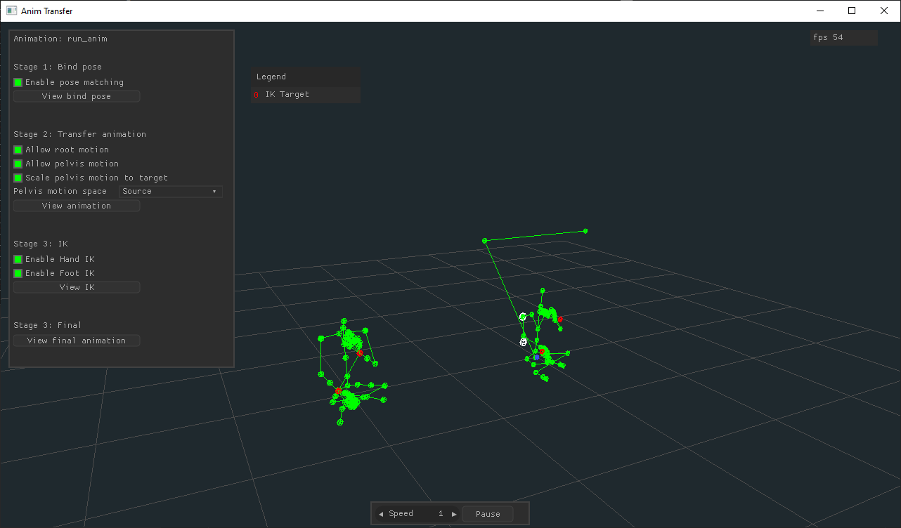

# Anim Transfer (gltf)


Transfer skeletal animations between human-like models (i.e. retargeting). Based on Unity's Mecanim humanoids and Unreal retargetters.

This is useful for those building custom 3d game engines and would like to use existing animation assets from the popular marketplaces.

The tool is written in C and OpenGL.

## Work in progress
Reads a .gltf source animation and target skeleton and produces a visualization of a reasonable transfer, but does not yet export to any format.

## Building
```
vcvarsall.bat x64
build.bat <debug|release> <run>
```

## Dependencies
- Nuklear IMGUI
- GLFW
- GLAD